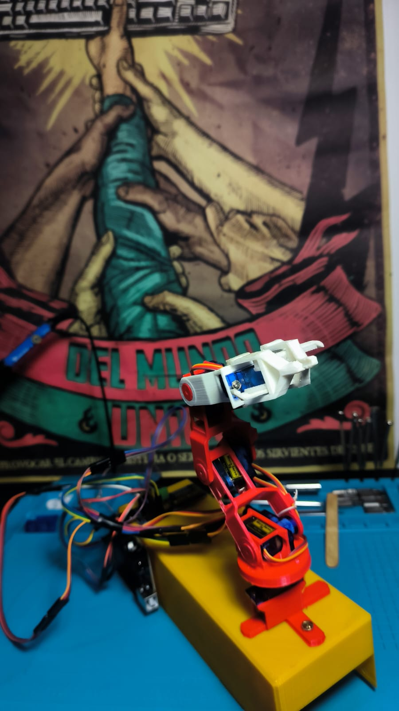
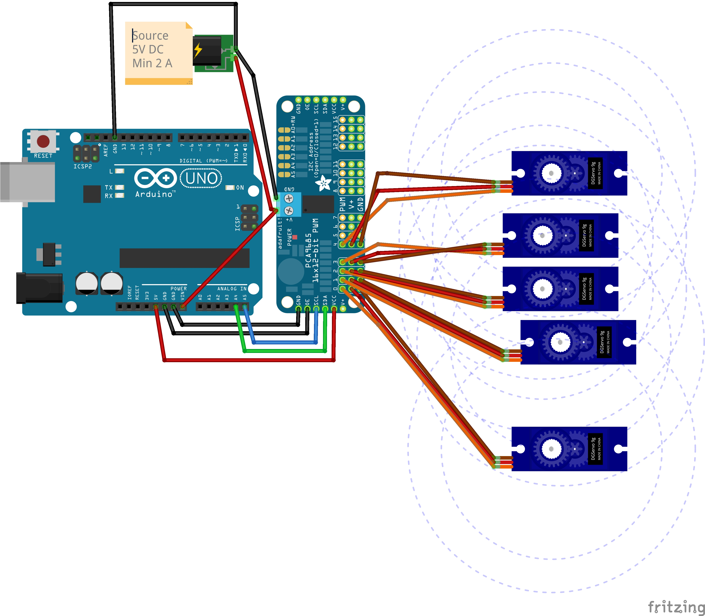

# DIY Robotic Arm with Arduino

## Getting Started

Want to build your own robotic arm with Arduino? In this project, I’ll show you how to create one from scratch and share the essential steps for a fully functional robotic arm.

### Demo: Dancing Arm
The first feature: a dancing robotic arm! Watch as it performs moves you've programmed.

## Project Outline

### 1. Components Used
A breakdown of the parts you'll need:
   - PCA 9685 Servo Driver
   - Arduino UNO
   - SG90 Servo Motors
   - 3D Printed Parts (using Cura Maker)
   - Jumper Wires

### 2. Building the Arm
Detailed steps to assemble your robotic arm, focusing on positioning each part and ensuring stability.

### 3. Wiring Diagram
Clear, easy-to-follow Fritzing diagrams for connecting all components.

### 4. Code Explanation
A step-by-step walkthrough of the code, including:
   - Custom functions for arm movements.
   - Explanation of each section to help you understand how it all works.

### 5. Calibration
A guide to properly calibrate the arm to ensure smooth and accurate movement.

### 6. Predefined Functions
Demo of preset movements, including various functional and entertainment motions.

## Looking Ahead
Stay tuned for Version 2! We'll take this robotic arm further with the ESP32 CAM module.
